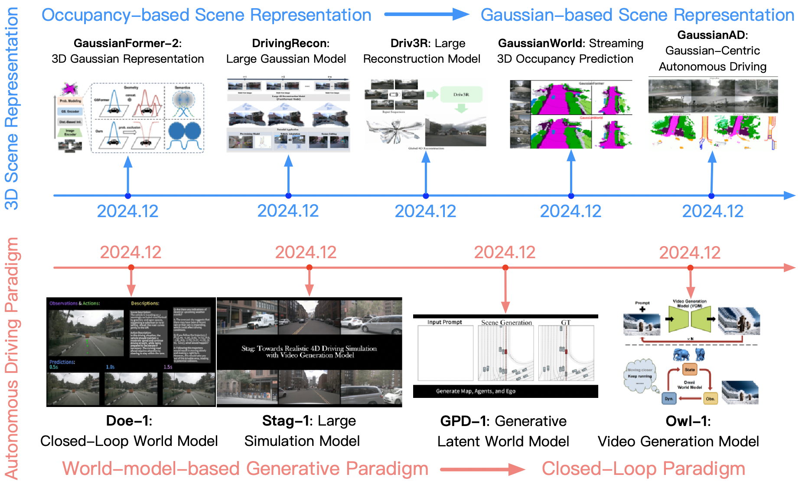

又看了一遍回放，找到了几个小点再来分享一下：

1. 特征表示：3D空间表征已经从BEV时代转为3D高斯表征时代，同时也标志着车端模型和仿真世界模型的3D表示统一了（理论上仿真模型只需要输出3D高斯表示给模型做仿真训练，不需要真的输出视频图像了）。[图1][1]

输入的表示演进：单目2D->单目3D->多目BEV+Occ->3D高斯；可以参考[图2][图3][2]总结的很好

但是也注意到目前MindGPT的预训练似乎使用的还不是3D高斯表示，尚未统一，仍然需要一个Projector进行维度对齐[图4]，这也说明了能作为空间三维表示的数据有多缺乏，数量级还不能支撑模型预训练级别；理想基座大模型的人加油啊！

2. 快慢思考的实现：LLM是并行输出action和语言内容的，单向注意力+双向注意力混合，每次LLM的循环吐一个语言token+当前动作的所有token[图5]。这样的机制可以保证动作token稳定输出的同时，保留语言token的变长特性，并让轨迹token输出可以通过双向注意力利用上语言token的所有信息（包括CoT的所有内容）；

3. 轨迹输出：最后的轨迹输出使用一个 diffusion head，但不仅输出自车轨迹，也输出其他所有agent的轨迹，提高复杂场景博弈能力。且diffusion方式能通过前方LLM的输入修改轨迹输出风格【类似LoRa】；

4. 最终对齐：使用 RLHF 和人类价值观做对齐，最终使用生成模型+重建模型的世界模型进行强化学习。

VLA模型没有说具体速度，只是说达到10t/s有难度

[1] GaussianAD: Gaussian-Centric End-to-End Autonomous Driving https://arxiv.org/abs/2412.10371

[2] Large Driving Models https://github.com/wzzheng/LDM

[3] MotionDiffuser: Controllable Multi-Agent Motion Prediction using Diffusion https://arxiv.org/abs/2306.03083

[4] DiffusionDrive: Truncated Diffusion Model for End-to-End Autonomous Driving https://arxiv.org/abs/2411.15139

[5] GoalFlow: Goal-Driven Flow Matching for Multimodal Trajectories Generation in End-to-End Autonomous Driving https://arxiv.org/abs/2503.05689

[6] Finetuning Generative Trajectory Model with Reinforcement Learning from Human Feedback https://arxiv.org/abs/2503.10434

