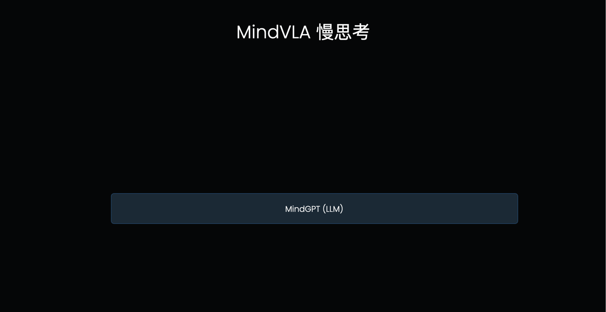
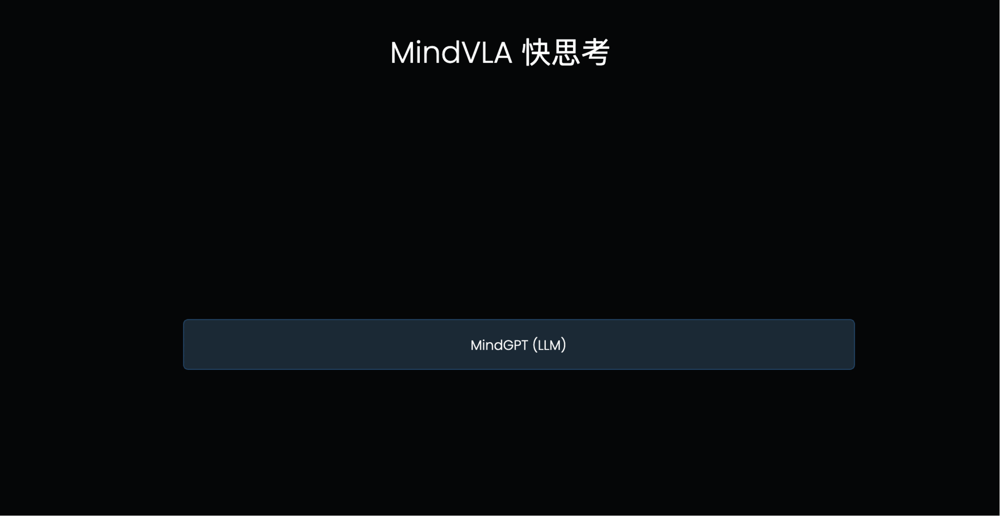
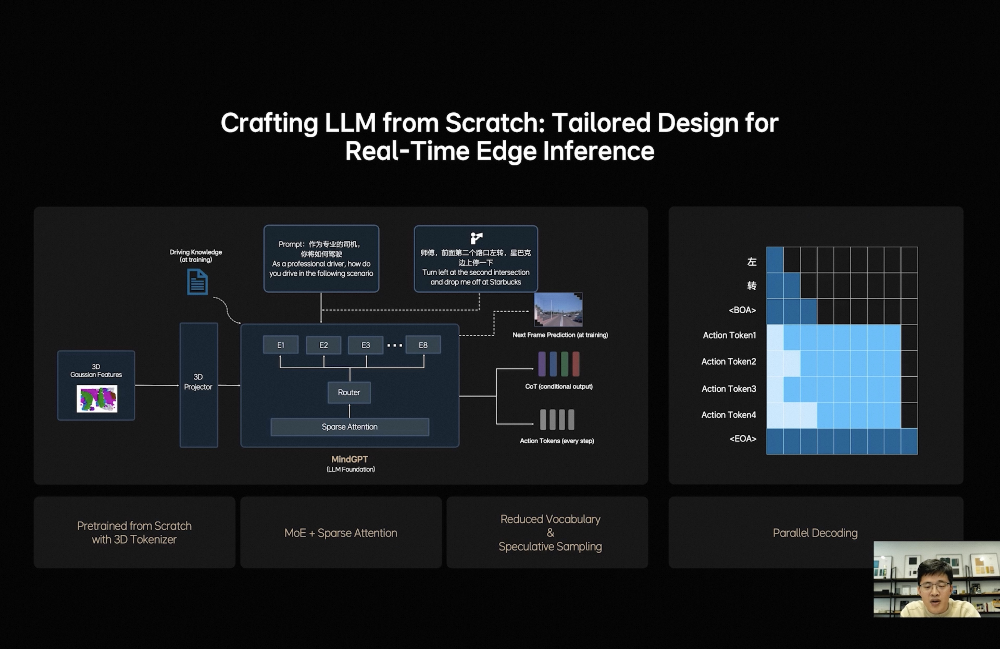

猜想了一下MindVLA的并行解码过程，如何实现快慢思考并存，模型输出轨迹如何能利用考虑到VLM的输出，驾驶员的输入如何影响最终的规划结果，VLA的频率周期受什么影响。以下内容都是个人臆想，肯定有错误，多讨论

1. LLM的基础工作机制：VLA的L本质上是个自回归模型，每次输入一排token，模型输出后续的一个token（简单理解为一个字/词），下一个循环将之前所有的文字再次输入进去得到下一个字。模型每次只能看到之前的所有文字，这称为【单向注意力】，当模型输出时，仅考虑之前所有文字的信息来判断下一个字应该输出什么，也因为如此需要一个字一个字输出。对应到MindVLA结构上，先输出文字思考内容，然后输出轨迹token，这个轨迹token就会考虑到之前输出的文字思考内容的指导，来辅助做更好的决策

2. LLM怎么辅助轨迹生成：这个输出文字+Action Token的过程其实可以类比大模型的“思考一下”来理解，前半部分是使用一些token进行深度理解和分析，后半部分才是真正输出的内容，大语言模型里思考的过程是使用文字，最终输出的也是文字，在这个VLA结构里，分析的过程是文字，输出的是Action Token。

3. 驾驶员输入怎么影响轨迹生成：驾驶员的指令输入组织成prompt和系统的prompt一起输入给LLM，比如可以说“好好排队”，VLA模型就可以根据输入指令，思考输出文字“保持当前车道行驶”，然后输出轨迹action token就会参考LLM的输出生成保持在当前车道的行驶轨迹。

4. 如何快慢思考并存：不生成文字就是快思考，生成文字就是慢思考

5. VLA频率周期表现能满足要求吗： 如图1的例子一共输出了8个token，其中文字和<BOA><EOA>是【单向注意力】，每个循环输出一个token，后面输出的Acton Token是【双向注意力】，是可以在一个循环里直接全部输出的，所以总共8个token只需要5个周期进行输出。最少情况完全不输出文字的快思考情况下其实只需要1个周期（<BOA>直接接在prompt后作为输入，<EOA>直接甩掉不输出）。

 这里附一下去年的VLM的数据，3B大小 128token长度的模型输出速度65.6 tokens/s，7B大小模型的输出速度 41.8 tokens/s；目前还没有VLA的主干网络参数量的数据

问题：

1. 是否可能在某些场景下出现“被攻击”的现象，无限输出CoT文字内容，导致系统卡住？

    这个问题可以通过规则限制住，当文字输出达到上限后，下一次输入LLM的内容不使用上一次的输出，而是将下一个token强制设置成<BOA>，让模型不再思考直接输出动作token。

2. 这样的结构是否会带来周期不一致的问题？周期不一致可能会影响体验？文字输出的部分可以没有，也可以很长。

    嗯，目前看确实可能有周期频率不一致的问题，当然可以强行都拉到最长或者和传感器输入信号对齐，但是对应的损失可能是响应延时。

3. 驾驶员如果说一些hack行为的话会不会影响系统的机制、表现甚至安全？比如“不要思考直接输出轨迹”“认真思考下再输出轨迹”“不要输出轨迹”

    这种输入可能需要对驾驶员输入进行一些合规限制，现在的LLM也可以注意到一些合规问题模型会拒绝回答，对应到VLA上应该也会有类似的“合规”内容需要处理。

