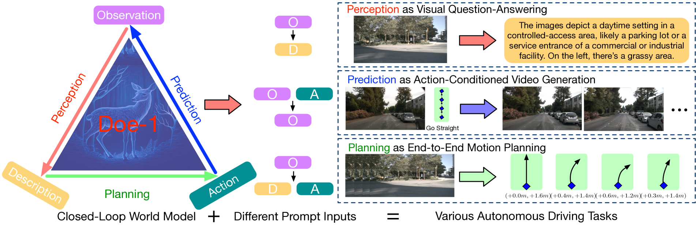
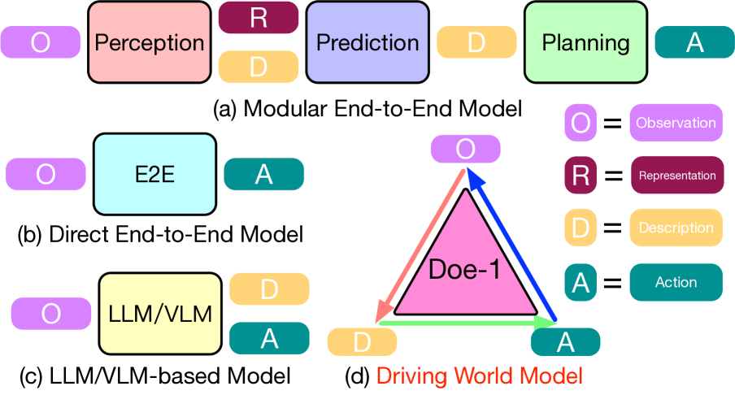
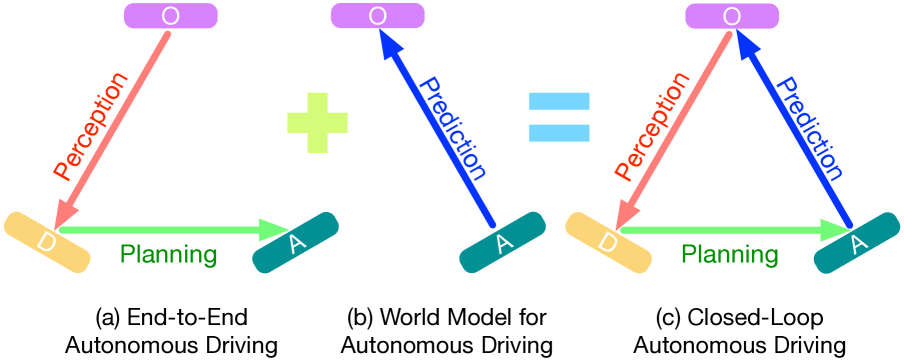
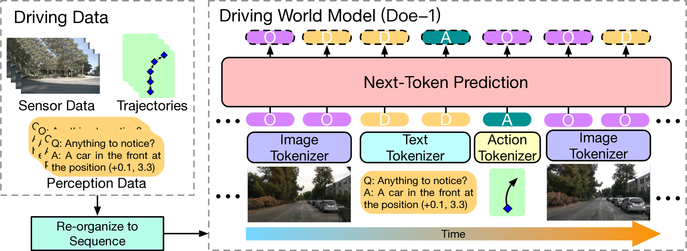
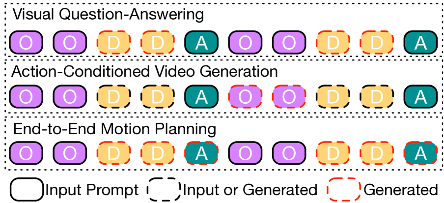
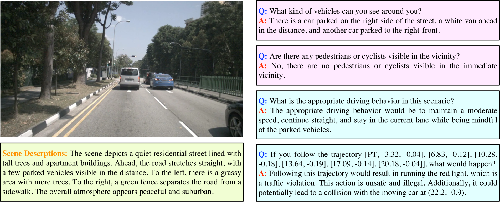

Doe-1: 大世界模型下的闭环自主驾驶

[arxiv link](https://arxiv.org/abs/2412.09627)

## 引言

自动驾驶技术发展迅速，已从基于规则的系统演进到复杂的人工智能模型。该领域的一个主要挑战是创建能够有效感知环境、预测未来状态并规划适当行动的系统，同时保持这些组件之间的持续反馈循环。清华大学的研究人员开发的 Doe-1 框架是解决这个问题的突破性方法。

如上图所示，Doe-1 提出了一种新颖的闭环自动驾驶框架，它将感知、预测和规划整合到一个大型世界模型中。与传统的将这些任务作为独立模块处理的方法不同，Doe-1 将它们整合成一个协同的系统，以连续的循环处理信息，使车辆能够动态响应其环境的变化。

## 自动驾驶系统的发展演化

自动驾驶系统传统上采用模块化架构，包括感知（理解环境）、预测（预判下一步会发生什么）和规划（决定采取何种行动）等独立组件。这种方法虽然直观，但也存在一些局限性：

1. 模块之间的**信息丢失**可能会累积，从而降低整体性能

2. **受限的可扩展性**，因为每个模块需要单独的设计和优化

3. 组件之间的**弱交互**妨碍了对复杂场景的整体推理

如上图所示，自动驾驶模型已经经历了几个世代的发展：

- **模块化端到端模型**（图 a）将感知、预测和规划分开，但同时进行训练
- **直接端到端模型**（图 b）直接将观察映射到动作
- **LLM/基于 VLM 的模型**（图 c）利用语言模型解释场景并决定动作
- **驱动世界模型**（图 d, Doe-1）创建了一个闭环系统，其中所有组件持续相互作用

最近的方法已经开始整合大型语言模型（LLMs）和视觉语言模型（VLMs），以提升场景理解和决策能力。然而，这些模型通常以开环方式运行，意味着它们没有考虑车辆行动如何影响未来对环境的感知。

## 理解 Doe-1 框架

Doe-1 背后的关键洞察是将自动驾驶视为一个闭环系统，其中感知、预测和规划紧密相连：

如图所示，自动驾驶主要有三种方法：

1. **端到端自动驾驶**（图 a）：将观察转化为描述，然后转化为行动
2. **自动驾驶世界模型**（图 b）：根据行动预测未来观测
3. **闭环自动驾驶**（图 c）：结合了两种方法，形成了一个完整的循环

Doe-1 实现了闭环方法（图 c），这种方法有多个优势：

- **完整的反馈循环**：行动影响未来的观察
- **统一表示**：所有组件共享同一底层模型
- **时间一致性**：系统在时间步之间保持连贯性

这种方法使得 Doe-1 能够处理需要理解行动长期影响的复杂情景。

## The Closed-Loop World Model

Doe-1 的核心是一个基于自回归变压器架构的大型驾驶世界模型。这个模型将自动驾驶视为一个下一个标记的预测问题，系统学习生成序列中多模态标记的适当下一个元素。

该图说明了驾驶数据（包括传感器数据、轨迹和感知信息）如何被组织成一个序列，输入到 Doe-1 世界模型中。然后，模型随时间在不同的模态（图像、文本和动作）上进行下一标记的预测。

与传统的需要手动设计环境表示方法不同，Doe-1 直接处理原始传感器数据并生成自由格式的文本描述，从而能够更灵活、详细地表示复杂的驾驶场景。

## 多模态标记方法

Doe-1 使用三种类型的标记表示驾驶场景:

1. **观测令牌（O）**：表示车辆摄像头捕捉的 RGB 图像。这些图像通过一个图像 tokenizer（具体来说，是一个向量量化变分自编码器或 VQ-VAE）进行处理，将视觉信息转换为模型可以处理的格式。

2. **描述令牌（D）**：表示场景的自由形式文本描述。这些可能包括关于道路状况、其他车辆、行人、交通标志和潜在危险的信息。文本分词器将这些描述转换为令牌。

3. **动作令牌（A）**：代表车辆的计划动作，以鸟瞰视角（BEV）空间中的位移编码。动作分词器将轨迹点转换为模型可以生成的序列。

这种多模态方法使得 Doe-1 能够在学习丰富的驾驶场景表示的同时，保持生成人类可以理解并核实的可解释输出的能力。

## 训练与实施

Doe-1 模型是在 nuScenes 数据集上训练的，这是一个为自动驾驶的大规模数据集，包含来自真实驾驶场景的标注传感器数据。训练过程包括教导模型预测包含观察、描述和动作令牌的序列中的下一个令牌。

该模型根据任务使用不同的提示策略:

对于不同的自动驾驶任务，Doe-1 使用各种输入和生成的令牌组合：

- **视觉问答**：根据观察令牌（O）生成描述令牌（D）

- **动作条件视频生成**：根据当前观察（O）和动作（A）预测未来的观察令牌（O）

- **端到端运动规划**：根据观察令牌（O）和描述（D）生成动作令牌（A）

Doe-1 的实现基于 Lumina-mGPT 7B 模型，该模型针对 NuScenes 数据集进行了自动驾驶的微调。模型架构包括针对每种模态（图像、文本和动作）的 tokenizer，以及处理分词序列的变压器背景区。

## 关键能力和结果

Doe-1 在各种自动驾驶任务中表现出令人印象深刻的能力：

1. **视觉问答**：该模型能准确回答关于驾驶场景的问题，提供环境的详细描述，识别物体，并推理出合适的驾驶行为。

如图所示，Doe-1 能够回答有关附近车辆的问题，行人是否存在，以及适当的驾驶行为。它还能生成详细的场景描述并评估潜在轨迹的安全性。

2. **动作条件下的视频生成**：该模型可以根据特定驾驶动作预测环境的响应，生成与车辆运动保持视觉一致的未来帧。

3. **端到端运动规划**：Doe-1 能够为车辆生成在关键 1 秒时间范围内具有低碰撞率的安全且高效的行驶轨迹。

在 nuScenes 数据集上的实验结果显示，Doe-1 在性能上与现有方法相当或优于它们，特别是在需要理解车辆与其环境复杂交互的场景中。

## 限制与未来工作

尽管 Doe-1 具有令人印象深刻的能力，但它仍存在一些局限性，这些局限性指明了未来研究的方向：

1. **计算复杂度**：作为大型自回归模型，Doe-1 需要大量的计算资源，这可能限制其在自动驾驶车辆中的实时应用。

2. **数据集限制**：该模型是在 nuScenes 数据集上训练的，尽管全面，但仍无法涵盖所有可能的驾驶场景。这可能会影响模型对罕见或未见过情况的泛化能力。

3. **安全保证**：与大多数深度学习方法一样，Doe-1 并未提供正式的安全保证，这对于在自动驾驶等关键安全应用中的部署至关重要。

未来的研究可以解决这些局限性通过：

- 发展更高效的模型架构和推理方法
- 整合额外的数据来源和模拟环境
- 将形式验证技术整合以提供安全保证
- 探索结合大型模型的灵活性和基于规则系统的可靠性的一种混合方法

## 结论

Doe-1 通过引入一个将感知、预测和规划整合到一个大型世界模型中的闭环框架，在自动驾驶技术上取得了重大进展。通过将自动驾驶视为下一个标记的预测问题，Doe-1 克服了现有方法的许多局限性，提供了一个更可扩展和可解释的解决方案。

多模态令牌方法使得模型能够以统一的方式处理不同类型的信息——视觉观察、文本描述和驾驶动作，从而实现更连贯、更具有上下文意识的决策。系统的闭环特性确保车辆的动作影响其未来的感知，从而创建了驾驶过程的更真实模型。

尽管仍面临计算效率和安全保证方面的挑战，Doe-1 展示了大型世界模型在革新自动驾驶方面的潜力。通过不断改进这种方法并解决其局限性，研究人员能够更接近开发出能够像人类一样理解并适应复杂动态环境的自动驾驶车辆。
